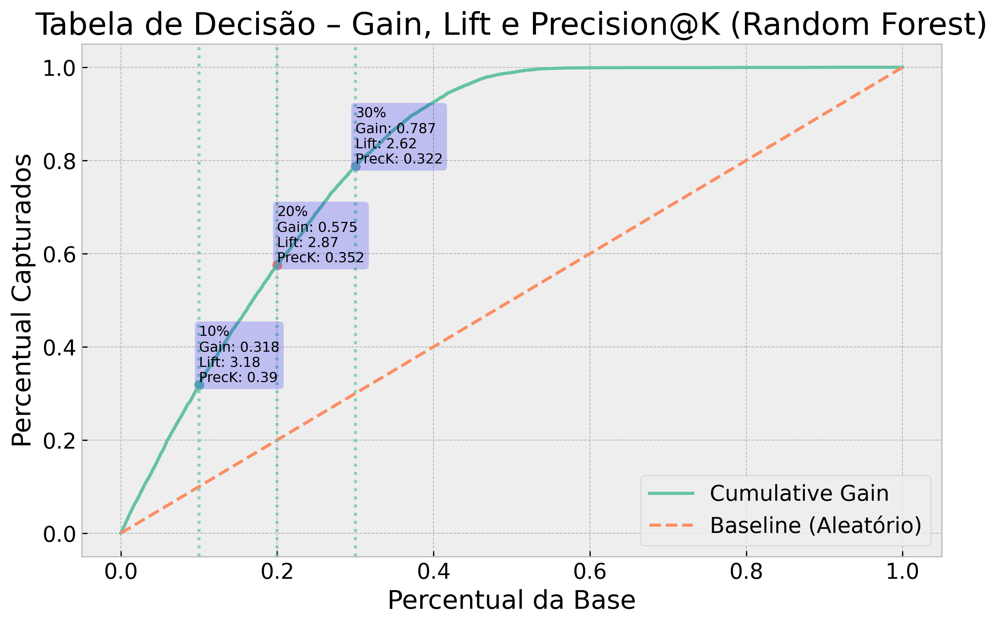
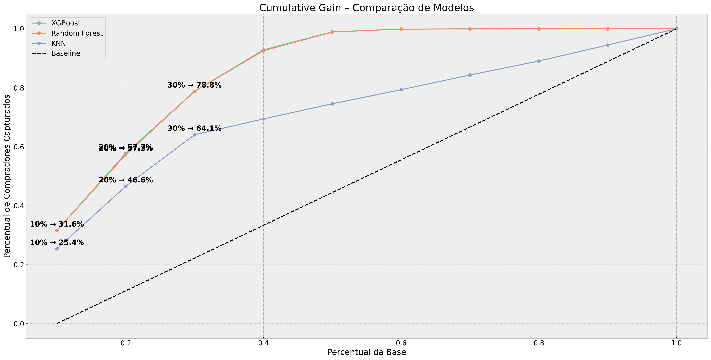
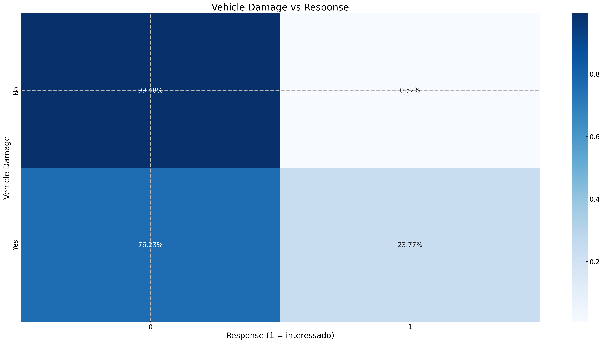
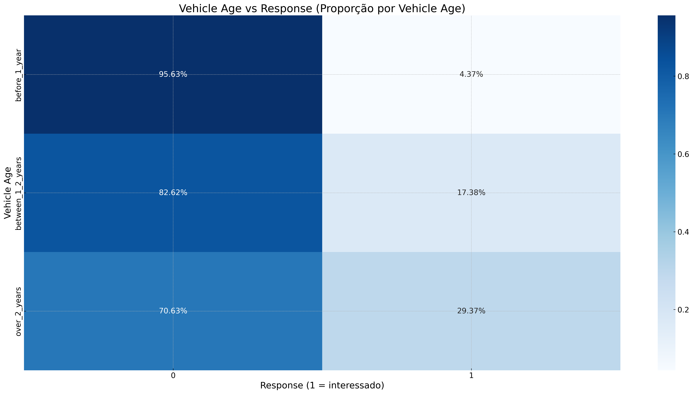
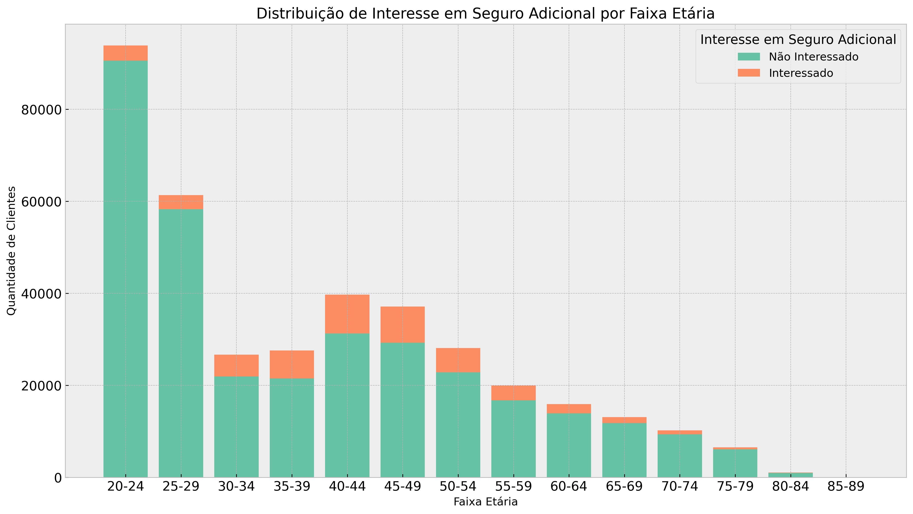
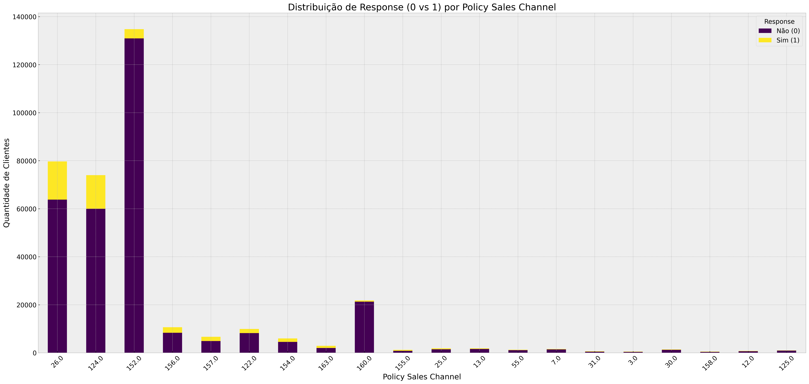
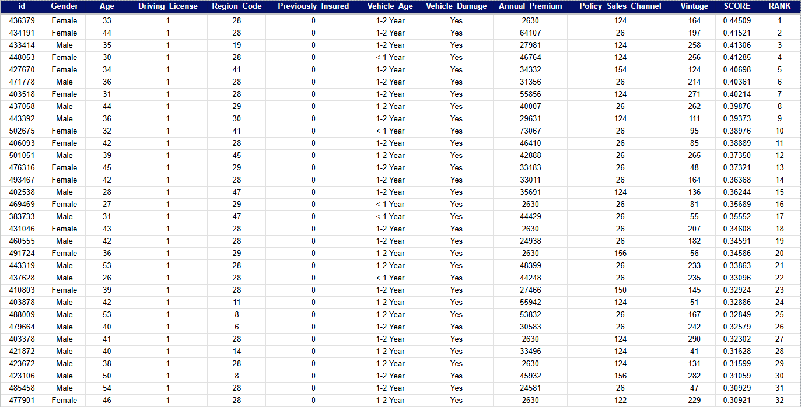

<h1>📈 Health Insurance Cross-Sell — Projeto End-to-End de Ciência de Dados</h1>

Solução de <strong>Machine Learning</strong> para priorização de clientes com maior propensão a contratar um seguro veicular adicional (cross-sell), construída a partir de um pipeline completo de Ciência de Dados com foco em valor de negócio, eficiência operacional e deploy em produção.

<h2>🎯 Problema de Negócio</h2>

O Head de Vendas de uma seguradora identificou que a empresa apresentava uma <strong>baixa taxa de conversão</strong> em campanhas de cross-sell de seguro veicular, além de um <strong>alto custo operacional</strong> associado às ligações realizadas pelo time comercial.

Até então, os clientes eram abordados sem qualquer tipo de priorização inteligente, resultando em:

<ul>
  <li>Desperdício de recursos com clientes sem interesse</li>
  <li>Baixa eficiência do time de vendas</li>
  <li>Custo elevado por aquisição (CPA)</li>
</ul>

Diante desse cenário, este projeto tem como objetivo construir um modelo de Machine Learning capaz de <strong>ranquear os clientes</strong> de acordo com a probabilidade de interesse em um seguro veicular adicional, permitindo que a seguradora concentre seus esforços nos clientes com maior chance de conversão.

<h2>📌 Objetivos de Negócio</h2>
<ul>
  <li>Aumentar a taxa de conversão da campanha de cross-sell</li>
  <li>Reduzir o custo por aquisição (CPA)</li>
  <li>Direcionar o time comercial para os clientes mais promissores</li>
  <li>Responder perguntas estratégicas como:</li>
  <ul>
    <li>Quantos interessados seriam captados ao abordar os top 10%, 20% e 30% dos clientes?</li>
    <li>Qual o ganho em relação a uma estratégia aleatória?</li>
    <li>Qual o uplift financeiro gerado pela priorização?</li>
  </ul>
</ul>

<h2>🧩 Metodologia</h2>

O projeto foi estruturado seguindo um pipeline completo de Ciência de Dados:

<ul>
  <li>Entendimento do Problema de Negócio</li>
  <li>Coleta e Descrição dos Dados</li>
  <li>Limpeza e Tratamento de Dados</li>
  <li>Análise Exploratória de Dados (EDA)</li>
  <li>Preparação dos Dados</li>
  <li>Engenharia e Seleção de Features</li>
  <li>Modelagem (Baseline → Modelos Avançados)</li>
  <li>Fine-Tuning com Optuna</li>
  <li>Avaliação com Métricas de Negócio</li>
  <li>Deploy em Produção</li>
</ul>

<h2>📈 Resultados</h2>

Ao priorizar apenas uma fração dos clientes com maior score, é possível capturar grande parte dos interessados.

O gráfico acima apresenta simultaneamente as curvas de <strong>Ganho Acumulado</strong>, <strong>Lift@K</strong> e <strong>Precision@K</strong>, destacando explicitamente os pontos de corte em <strong>10%</strong>, <strong>20%</strong> e <strong>30%</strong> da base.

Em cada ponto, são exibidas três métricas fundamentais para a tomada de decisão:

<ul>
  <li><strong>Ganho Acumulado</strong>: percentual de todos os interessados reais capturados até aquele cutoff.</li>
  <li><strong>Lift@K</strong>: quantas vezes o modelo é melhor do que uma seleção aleatória.</li>
  <li><strong>Precision@K</strong>: proporção de clientes realmente interessados dentro do grupo abordado.</li>
</ul>

Esses pontos representam diferentes estratégias operacionais, permitindo ao negócio escolher entre maior eficiência (top 10%) ou maior volume absoluto de conversões (top 30%).

<table border="1" cellpadding="6">
  <tr>
    <th>Cutoff (%)</th>
    <th>Clientes Abordados</th>
    <th>Interessados Capturados (Modelo)</th>
    <th>Ganho Acumulado (%)</th>
    <th>Ticket Médio (USD)</th>
    <th>Receita Estimada — Modelo (USD)</th>
    <th>Receita Esperada — Aleatório (USD)</th>
  </tr>
  <tr>
    <td>10%</td>
    <td>7.622</td>
    <td>2.975</td>
    <td>31,85</td>
    <td>32,786.00</td>
    <td>97,538,350.00</td>
    <td>30,622,124.00</td>
  </tr>
  <tr>
    <td>20%</td>
    <td>15.244</td>
    <td>5.370</td>
    <td>57,48</td>
    <td>32,786.00</td>
    <td>176,060,820.00</td>
    <td>61,244,248.00</td>
  </tr>
  <tr>
    <td>30%</td>
    <td>22.866</td>
    <td>7.355</td>
    <td>78,73</td>
    <td>32,786.00</td>
    <td>241,141,030.00</td>
    <td>91,866,372.00</td>
  </tr>
</table>

Ao abordar apenas os <strong>30% dos clientes com maior score</strong> (22.866 clientes), o modelo captura aproximadamente <strong>78,7%</strong> de todos os interessados reais da base.

Isso representa um <strong>lift de 2,62x</strong> em relação a uma estratégia aleatória, com uma <strong>precision@30% de 32,2%</strong>, ou seja, quase 1 em cada 3 clientes abordados demonstra interesse real no produto.

Do ponto de vista financeiro, o modelo gera um <strong>uplift de receita altamente relevante</strong>.  
No cutoff de 30%, a receita estimada com o modelo é de <strong>USD 241,1 milhões</strong>, contra apenas <strong>USD 91,9 milhões</strong> em uma abordagem aleatória, um ganho incremental superior a <strong>USD 149 milhões</strong>.

<strong>Premissa financeira:</strong>  
Os valores monetários são estimativas baseadas na mediana da variável <code>annual_premium</code>, assumindo que cada cliente convertido gera uma receita anual equivalente ao ticket médio do seguro.

<h2>📉 Evolução do Modelo</h2>
<ul>
  <li>Baseline: KNN</li>
  <li>Modelos testados: Random Forest, XGBoost</li>
  <li>Seleção baseada em Curva de Ganho e NDCG@K</li>
</ul>

O Random Forest foi escolhido como modelo final principalmente pela métrica de ranking:

<ul>
  <li>NDCG@10% (Random Forest): 0,3950</li>
  <li>NDCG@10% (XGBoost): 0,3944</li>
</ul>

<h2>🔎 Principais Insights de Negócio</h2>

<strong>Dano por veículos</strong>

Clientes que já sofreram danos em veículos demonstram maior interesse por seguros do que aqueles que nunca tiveram danos, indicando que experiências negativas anteriores aumentam a percepção de risco e a propensão à contratação.

<strong>Idade dos veículos</strong>

Clientes com veículos acima de 2 anos apresentam maior propensão à contratação, possivelmente por maior exposição a falhas mecânicas, desvalorização e riscos de manutenção.

<strong>Idade vs interessados</strong>

A maior concentração de interessados ocorre nas faixas etárias entre 40 e 49 anos, sugerindo um perfil de cliente mais estável financeiramente e com maior aversão ao risco.

<strong>Canais de contato</strong>

Dois canais de venda (<code>policy_channel</code>) concentram a maior parte das respostas positivas, indicando oportunidades claras de otimização do mix de canais comerciais.

<h2>🚀 Produto de Dados em Produção</h2>

O modelo é consumido via uma <strong>API</strong> integrada ao <strong>Google Sheets</strong>, permitindo que o time comercial utilize as previsões diretamente em uma interface familiar, sem necessidade de ferramentas técnicas adicionais.

O fluxo operacional é:

<ol>
  <li>Upload do CSV com dados de clientes em produção.</li>
  <li>Clique em um botão para gerar previsões.</li>
  <li>Retorno de duas colunas adicionais na planilha:</li>
  <ul>
    <li><strong>RANK</strong>: ordenação dos clientes por prioridade de abordagem.</li>
    <li><strong>SCORE</strong>: probabilidade estimada de interesse no seguro veicular.</li>
  </ul>
</ol>

A planilha em produção pode ser acessada pelo link abaixo:
 
<a href="https://docs.google.com/spreadsheets/d/1Dts6nD_rmfh2Cv-5oA4mrzZ-9kNECVs6d7qX4UYfO8k/edit?usp=sharing" target="_blank">
Google Sheets
</a>

Repositório relacionado à API:
 
<a href="https://github.com/polloncarlos/health_insurance_api" target="_blank">
Health Insurance API
</a>

<em>
Observação: a ordenação exibida na planilha já evidencia padrões compatíveis com os insights de modelagem, como a forte influência das variáveis <strong>previously_insured</strong> e <strong>driver_license</strong>, o que reforça empiricamente o risco de leakage discutido na seção seguinte.
</em>

<h2>⚠️ Risco de Leakage</h2>

Duas variáveis apresentam forte indício de vazamento de informação (data leakage) e impactam diretamente a ordenação exibida no produto em produção:

<ul>
  <li><strong>previously_insured</strong>: 99,91% dos clientes que já possuem seguro veicular não demonstram interesse em adquirir outro.</li>
  <li><strong>driver_license</strong>: 87,73% dos clientes que possuem carteira de motorista não demonstram interesse no seguro ofertado.</li>
</ul>

Essas variáveis praticamente definem a resposta do modelo. Isso pode ser observado diretamente na planilha de produção, onde os clientes com maior rank apresentam <code>previously_insured = 0</code> e <code>driver_license = 1</code>.

Em um ambiente real, essas features deveriam ser cuidadosamente reavaliadas ou removidas para evitar overfitting e falsas expectativas de performance.

<h2>🛠️ Stack Tecnológica</h2>
<ul>
  <li>Python 3.10</li>
  <li>Pandas, NumPy, Scikit-learn</li>
  <li>XGBoost</li>
  <li>Optuna</li>
  <li>Flask</li>
  <li>Google Sheets API</li>
</ul>

<h2>📌 Conclusão</h2>

Este projeto demonstra como modelos de Machine Learning podem ser traduzidos em <strong>decisão de negócio, priorização operacional e ganho financeiro mensurável</strong>.

Mais do que maximizar métricas tradicionais, o foco foi em gerar <strong>uplift real</strong> sobre uma estratégia aleatória, respeitando restrições práticas como custo operacional e capacidade do time comercial.

